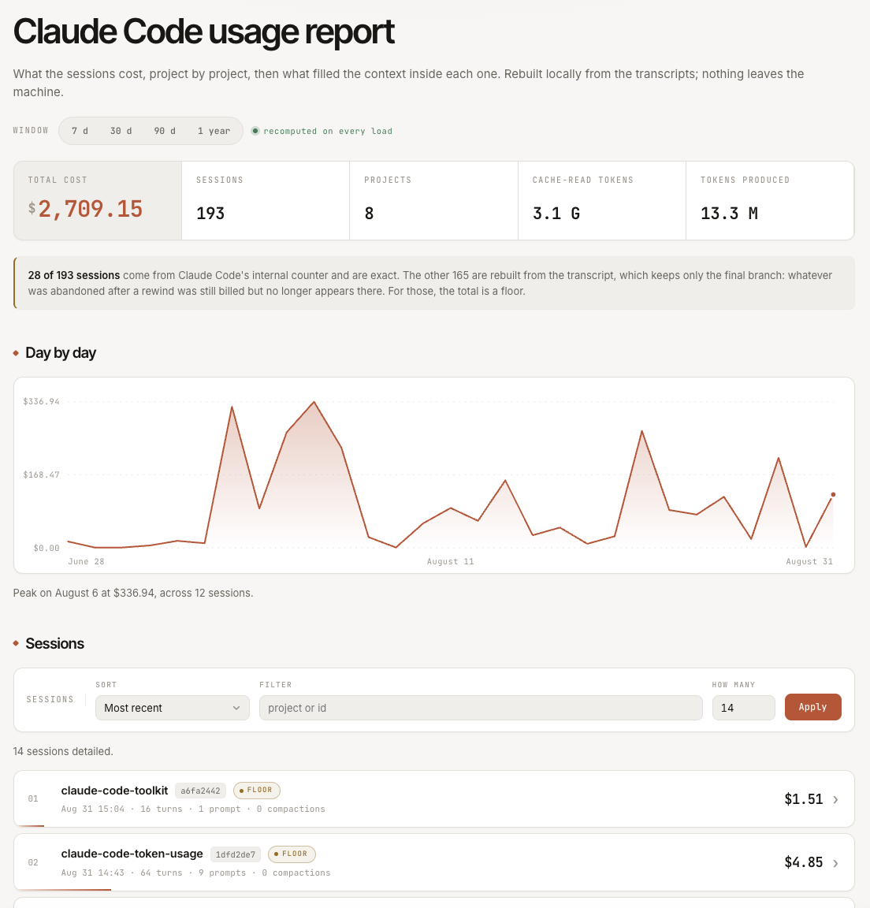
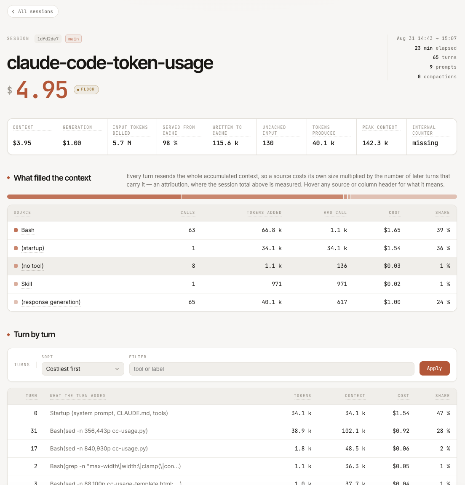

# Claude Code Token Usage

What your Claude Code sessions cost, project by project, then what filled the context
inside each one.



Reads `~/.claude/projects/**/*.jsonl` locally. No transcript, no prompt, no filename ever
leaves your machine. Python 3.10+, stdlib only.

## Install as a skill

The repository *is* a Claude Code skill. Clone it into `~/.claude/skills/`:

```bash
git clone https://github.com/pierrebelin/claude-code-token-usage.git ~/.claude/skills/token-usage
```

Copy **everything** — `SKILL.md`, `cc-usage.py`, `cc-usage-template.html`, `README.md`.
The script looks for the template in its own directory, and the folder name is what
`/token-usage` resolves to.

Then ask in plain language:

```
> how much have I spent this month?
> which project costs me the most?
> what filled the context of session 46e2620d?
> open the usage dashboard
```

`SKILL.md` also tells Claude how to *read* the result: which sessions are exact and which
are a floor, why a re-read after a compaction is not waste, what the carry factor means.
That reading grid is why the skill install beats a bare script.

## Dashboard

```bash
python3 ~/.claude/skills/token-usage/cc-usage.py --serve
```

`http://127.0.0.1:8787/`, loopback only, re-runs the analysis on every load (~0.8 s).
Home page: counters, cost per project, daily curve, session list. Each row opens its own
page (~0.1 s), showing the per-tool breakdown and every turn.



Sort and filter are GET forms: state lives in the URL, so
`?days=30&sort=date-desc&q=backend` is shareable, and nothing depends on JavaScript.

A frozen, self-contained HTML file instead of a server:

```bash
cc-usage.py --days 30 --dashboard report.html
cc-usage.py --dashboard session.html --focus 420f8978   # one session
```

## Terminal

The script is standalone:

```bash
echo "alias ccusage='python3 ~/.claude/skills/token-usage/cc-usage.py'" >> ~/.zshrc
```

```bash
ccusage --days 30 --top 12             # where the money goes, grouped by git root
ccusage --days 30 --sessions 10        # spot the costly session
ccusage --session 46e2620d --top 15    # take it apart
```

```
Source                 Calls  Tokens added  Cost $  Share
Bash                     198        162.1k   20.88    28%
(startup)                  3         94.9k   20.04    27%
(response generation)    224        251.9k   20.50    28%
Read                       6         76.8k    7.03    10%
```

## Options

| Option | Effect |
|---|---|
| `--days N` / `--since YYYY-MM-DD` | analysis window |
| `--project <substring>` | filter on the project key |
| `--by repo\|cwd\|dir` | grouping key (default: git root) |
| `--split-worktrees` | count each worktree separately |
| `--session <prefix>` | break down a single session |
| `--sessions N` | the N costliest sessions |
| `--models` / `--daily` | per-model / per-day breakdown |
| `--top N` | limit the display |
| `--serve [PORT]` | live dashboard (default 8787) |
| `--dashboard FILE` | write a self-contained HTML page |
| `--focus <prefix>` | with `--dashboard`, a single session |
| `--json` | machine-readable output |
| `--no-cost-state` | ignore the internal counters, recompute everything |
| `--no-fetch` | do not query LiteLLM for prices |
| `--sort-sessions <key>` | `date-desc` (default), `date-asc`, `cost-desc`, `cost-asc`, `project-asc` |
| `--sort-turns <key>` | `cost-desc` (default), `cost-asc`, `added-desc`, `carried-desc`, `turn-asc`, `turn-desc` |
| `--filter-sessions <text>` / `--filter-turns <text>` | text filters |
| `--sessions-max N` | detailed sessions (default 14, max 60) |

## How reliable the figures are

**Internal counter (`cost-state`)**, written by Claude Code into recent transcripts, is
authoritative and taken first — those sessions carry the `exact` chip.

**Rebuilt from the transcript** for older ones. This is a **floor**: the transcript keeps
only the final branch, so whatever was abandoned after a rewind was still billed but no
longer appears, and Haiku titling calls are never written. Measured gap where both exist:
**-51 %**. Those sessions carry the `floor` chip.

In session view, when the counter exists, amounts are rescaled onto it: the breakdown
comes from the transcript, the level from the counter.

## How attribution works

What a tool call costs is not what it returns, it is what it leaves in context. Every turn
resends the whole accumulation, so a heavy result inserted early is paid again on every
later turn.

Attribution measures real context growth between two turns —
`ctx(i) - ctx(i-1) - output(i-1)`, read from the API's `usage`, no tokenizer estimate —
then weights it by the number of turns that carried it. The sum reconstitutes the
session's context cost exactly. On a turn with parallel calls the delta is split in
proportion to result size; a compaction opens a new segment.

## What it reveals

- **Producing code costs nothing.** One session: 108 `Edit` for $0.64, 102 `Read` for
  $16.86. You pay for loading context.
- **Startup is a major line item.** System prompt + CLAUDE.md + tool definitions: 42.6 k
  tokens carried over 154 turns, $4.32 in one session. Every kilo-token of CLAUDE.md has a
  recurring cost.
- **`/compact` is expensive.** The injected summary is carried by every later turn: $5.41
  for one measured compaction. `/clear` costs a fraction — prefer it when the subject
  changes outright.
- **Re-reads are not the problem.** Post-compaction reads and `offset` reads set aside,
  only 2 % genuine redundancy was left.

## Limits

- Public API list price, not what a subscription bills. A comparative measure, not an
  invoice.
- The long-context rate (beyond 200 k tokens) is not modelled in the fallback computation.
- Subagents are not flagged `isSidechain`: their usage lands in the global counter but not
  in the per-tool breakdown.
- LiteLLM prices, cached 24 h in `~/.cache/cc-usage/`. Offline with no cache: tokens
  counted, cost 0, reported explicitly.
- Two optional outbound requests, neither carrying your data: the LiteLLM price file
  (`--no-fetch`) and the Google Fonts the page loads. For zero external request, delete
  the three `<link>` tags in `cc-usage-template.html` — system fallbacks are declared.

## Licence

[MIT](LICENSE).
